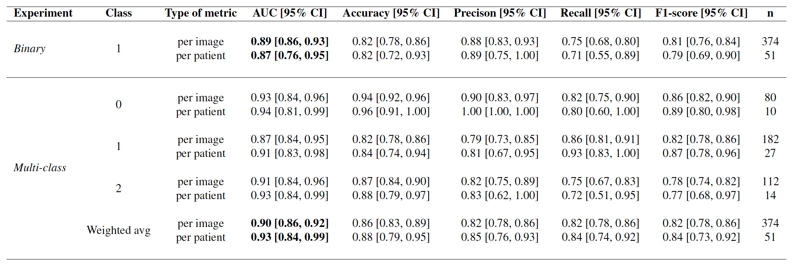

# CAD-RADS scoring of coronary CT angiography with Multi-Axis Vision Transformer: a clinically-inspired deep learning pipeline [](https://arxiv.org/abs/2304.07277) 

Official Repo of the paper "CAD-RADS scoring of coronary CT angiography with Multi-Axis Vision Transformer: a clinically-inspired deep learning pipeline" - [Alessia Gerbasi](https://scholar.google.com/citations?user=zzZZp_UAAAAJ&hl=it) et al.

The pipeline pre-processes multiplanar projections of the coronary arteries, extracted from the original CCTAs, and classifies them using a fine-tuned Multi-Axis Vision Transformer architecture [MaxViT](https://www.ecva.net/papers/eccv_2022/papers_ECCV/papers/136840453.pdf). 
Differently from previous proposed approaches the model does not require any additional annotation step that is not part of the clinical routine, and it is trained using a learning procedure that perfectly emulates the clinical screening process. 
Finally, user-friendly XAI maps offer to non-expert clinical users a transparent way to assess the reliability of the predictions, avoiding a completely black-box approach.


### Python requirements 
python > 3.7, this code has been tested with python 3.10.
All the required packages are listed in the `requirements.txt` file.

### Dataset requirements
The dataset used in this work was kindly provided by Cardiologico Monzino Center, Milan (IT).
It is not publicly available, but the proposed pipeline can be easily adapted to other datasets as long as they meet these simple requirements:

- images: any dimension gray-scale 2D images representing straightened multiplanar projections of the coronary arteries, extracted from the original 3D CCTA volumes.
- labels: CAD-RADS scores (0-5) for each patient enrolled.


If you want to directly use our code, data should be structured as follows:
1. `Data/Original/Img`: 
    - CR0_pt.00_LAD_se000.png
    - CR0_pt.00_LAD_se001.png
    - ...
    - CR0_pt.00_LCX_se000.png
    - CR0_pt.00_LCX_se001.png
    - ...
    - CR0_pt.00_RCA_se000.png
    - CR0_pt.00_RCA_se001.png
    - ...
  
Where `Data/Original/Img` is a folder with your dataset input images. 
The first part of the file name represents the original CAD-RADS score (CR0,...,CR5), the second part is the patient ID (pt.00, pt.01, pt.02, ...) and then you have the name of the artery (LAD, LCX, RCA) and the projection number (se000, se001, ...).

2. `Data/Original/CADRADS.csv` structured as follows:

| uniq_ID    |multi_Class| bin_Class | multi_Class_3 | img_LCX | img_LAD  |  img_RCA |
| :------------: |:-----------:|:-----------:|:---------------:|:---------:|:----------:|:----------:|
| CR0_pt.00  |     0         |     0          |       0             |    8    |    8     |    8     |
| CR0_pt.01  |     0         |     0          |       0             |    8    |    8     |    8     |
| CR4_pt.00  |     4         |     1          |       3             |    8    |    0     |    8     |

Where **uniq_ID** is the patient ID; **multi_Class** is the original CAD-RADS class;
**bin_Class** is the binary classification label (0: CR0-1-2-3, 1: CR4-5); 
**multi_Class_3** is the multi-class classification label we used for our experiments (0: CR0, 1: CR1-2-3, 2: CR4-5);
**img_LCX**,**img_LAD**,**img_RCA** are the numbers of each artery projections for the patient.

This is the tree structure of the folders you should have to directly use our code:
``` 
├── _00_Preprocessing
│   ├── preprocess.py
├── _01_SplitDataset
│   ├── split_dataset.py
│   ├── BinaryClass
│   │   ├── train
│   │   └── test 
│   └── MultiClass
│       ├── train
│       └── test   
├── _02_SyntheticData
│   ├── fill_dataset.py
│   ├── synthetic_data.py
│   ├── BinaryClass
│   │   ├── train
│   │   └── test 
│   └── MultiClass
│       ├── train
│       └── test  
├── _03_Train
│   ├── main.py
│   ├── main_cv.py
│   ├── train.py
│   ├── CAD_Dataset.py
│   └── LoadData.py
├── _04_Test
│   ├── test.py
│   └── support_functions.py
├── Data
│   ├── Original
│   │   ├── Img
│   │   │   ├── CR0_pt.00_LAD_se000.png
│   │   │   ├── CR0_pt.00_LAD_se001.png
│   │   │   ├── ...
│   │   └── csv
│   │       └── CADRADS.csv
│   ├── Preprocessed
│   │   └── Img
│   └── FullData
│       ├── train
│       └── test  
├── checkpoints
└── results
``` 

### Reproducing the experiments 
Since our pipeline is designed to be as flexible as possible, we provide a set of progressively numbered folders containing the scripts for each step. 
According to your needs, you can choose to run all the steps or jump to the one you are interested in.
In the `config.py` file you can find all the paths and parameters you can change to adapt the pipeline to your data.

- **_00_Preprocessing**
  - `preprocess.py`: preprocesses the dataset (resize, crop, normalize, etc.). 
    According to the quality of your dataset, you may not need all the steps, or you may need to customize the parameters. 
  
- **_01_SplitDataset**
  - `split_dataset.py`: splits the dataset into train and test sets
  
- **_02_SyntheticData**
  - `synthetic_data.py`: generates synthetic views of healthy coronary arteries if needed. 
  - `fill_dataset.py`: fills the dataset with the synthetic views 'Data/FullData'. 
  
- **_03_Train**
  - `main_cv.py`: trains the model on the train set with 10-fold cross-validation and parameter tuning based on validation accuracy.
  - `main.py`: script to train the model on the whole train set with the best parameters found in the previous step.
  
    Model's checkpoints will be saved in the folder `checkpoints`. 
    You can visualize the learning curves with [wandb](https://wandb.ai/site) while training.
  
- **_04_Test**
  - `test.py`: script to test the model on the test set and visually inspect the results. 
             Files with the measured metrics will be saved in the `results` folder.
  

### Results

If you want to download our model weights please compile [this form](
https://docs.google.com/forms/d/e/1FAIpQLScDs_0egdPDwWVe4Ed17bbdsw57oBtukDz0oUJ91KEUBc3-1w/viewform?usp=pp_url
).

<p align="center">

</p>

<p align="center">

</p>

### Comparisons
The pipeline is easy to use with any kind of classification model.
We compared the performance of different models including fully convolutional, attention based and hybrid models.

<p align="center">

</p>


## Citation
If you find this work useful for your research, please cite our paper:
```
@misc{gerbasi2023cadrads,
      title={CAD-RADS scoring of coronary CT angiography with Multi-Axis Vision Transformer: a clinically-inspired deep learning pipeline}, 
      author={Alessia Gerbasi and Arianna Dagliati and Giuseppe Albi and Mattia Chiesa and Daniele Andreini and Andrea Baggiano and Saima Mushtaq and Gianluca Pontone and Riccardo Bellazzi and Gualtiero Colombo},
      year={2023},
      eprint={2304.07277},
      archivePrefix={arXiv},
      primaryClass={eess.IV}
}
```